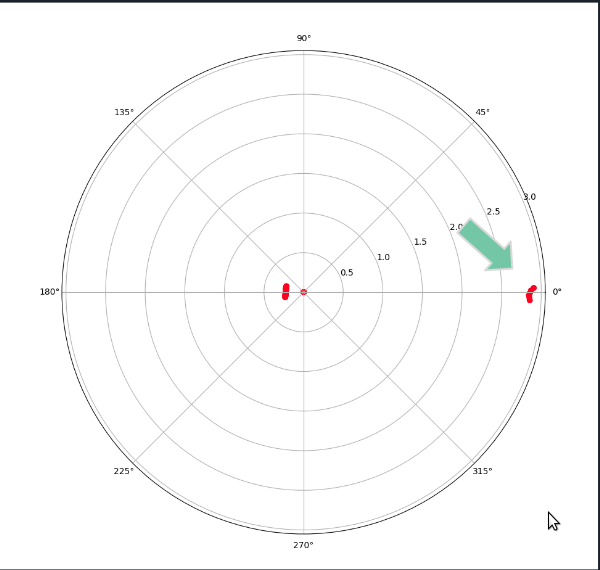
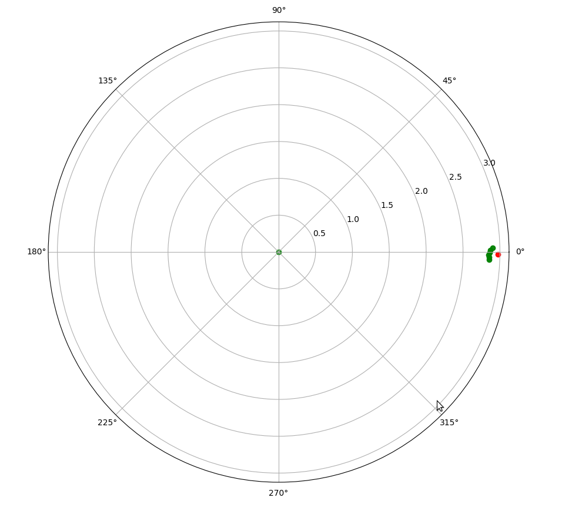

# Micro-AV Lidar

# Set up Environment 

- Open User Manual for YDLidar X4 on the [YDL official website](https://www.ydlidar.com/service_support.html) 
- Go to Section 3 - Linux ROS Operation, and follow steps 3.2:
	- [Download SDK driver](https://github.com/YDLIDAR/YDLidar-SDK)
	- Compile and Install YDLidar-SDK
	`$ git clone https://github.com/YDLIDAR/YDLidar-SDK.git`
	`$ cd YDLidar-SDK/build `
	`$ cmake ..`
	`$ make`
	`$ sudo make install`
- Install Dependencies
	`$ cd YDLidar-SDK`
	`$ pip install .` or `$ python setup.py build` + `$ python setup.py install`
	`$ pip install matplotlib`
- Open YDLidar-SDK/python/examples/plot_tof_test.py and change line 26 to this:
	`laser.setlidaropt(ydlidar.LidarPropSerialBaudrate, 128000)`
- Run Test
`$ cd YDLidar-SDK/python/examples/`
`$ python plot_tof_test.py`
- Your lidar should run and you can see a map on your screen
- Click the map and press 'q' to stop operation

# Getting .csv as result
- Download tof_test.py from this repo and replace the file in YDLidar-SDK/python/examples/
- run `python tof_test.py`
- Data will be stored in the specified folder

# Plotting results
- Use `plot.py` to plot results from csv files, don't forget to change change data path

# Dataset
Data is collected outdoors with a YDLidar x4

Configurations for ./data/12052021:  
- Range: 2m, 4m, 6m, 8m, 10m
- Cone Location: The cone should be located at 180 degree angle

Configurations for ./data/12202021:
- Range: 1m, 2m, 3m, 4m, 4.5m, 6m
- Cone Location: The cone should be located at 0 degree angle

# For CSE 455

## Objective
	The objective of the LiDAR cone detection part of this repo is to develop a quick, robust algorithm to detect certain landmarks and their location (e.g. a traffic cone) in order to provide information for autonomous vehicle localization and mapping (SLAM).

## Related Works
	[DROW - Deep learning based 2D Range data object detection](https://arxiv.org/pdf/1603.02636.pdf)

	A visualization of the workflow of the algorithm could be found on [Miro](https://miro.com/app/board/uXjVOWxLUZA=/?invite_link_id=217485385838)

## Approach 
The main supporting theory of the cone detection algorithm is the Bayes Theorem

In our case, the theorem looks like this:

Pr (location | data) = Pr (data | location) * Pr (location) / Pr (data)

Pr (data) can be treated as a normalizing constant

Please see the [PowerPoint Presentation](https://docs.google.com/presentation/d/1uIJyVBMq_NgbNEitB3g4IXcnHa_lk9Wc8Md_b6j2ZKY/edit?usp=sharing) for details of the algorithm.

More details of the cone detection algorithm and SLAM algorithm can be found [here](https://docs.google.com/document/d/19XMoWdjQoh1eNhDc6JA257_OSA0sTtXK/edit?usp=sharing&ouid=101840042751938244809&rtpof=true&sd=true)

## Current Results 

The green points represent input data, the red points represents the predicted centers, the blue dot and circle represents the ideal cone location.

## Video

[Link](https://drive.google.com/file/d/17wFgXcH1a11g3Xvoi9PhGUUXUfend84e/view?usp=sharing)
