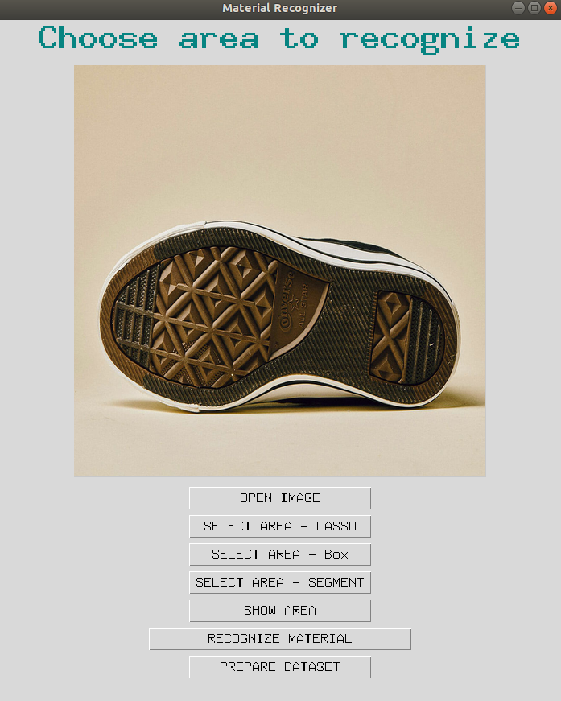

# material-recognition

This repo contains the code for mean-shift segmentation, image retrieval, and a tkinter app used to help artists recognize materials from images or UV maps.

## Setup

Required packages
`numpy`
`tqdm`
`pillow`
`matplotlib`
`opencv-python`
`pandas`
`scikit-learn`
`tk`
the following needs to comply with your CUDA version
`pytorch-gpu`
`torchvision`

## App Usage

Create a virtual environment and install required packages

To run the app, run this in command line
 `python app.py`

**Buttons**
- Open image -- opens file explorer and select an image for material recognition
- Prepare dataset -- encode all the images under `./datasets/data` and save the .pkl file under `./encoded`. Do this first so the app doesn't have to take time to encode the whole dataset every time you recognize the material.
- Recognize material -- search the dataset for the most similar images and show the top 10 results
- Select area -- Select the area of interest in different ways

## Source
Mean-Shift Segmentation
https://github.com/fjean/pymeanshift

Image Retrieval
https://www.kaggle.com/code/theaayushbajaj/content-based-image-retrieval-pytorch/notebook
